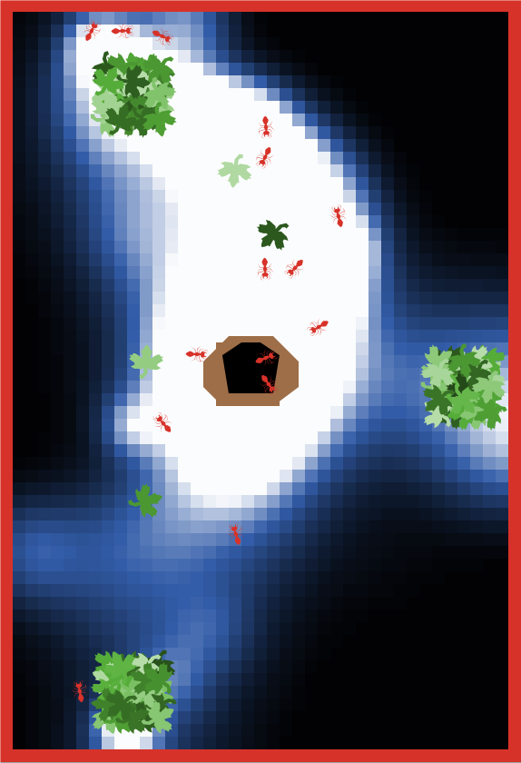

# emergent_communication_in_agents
Repository accompanying the paper **Emergent communication enhances foraging behaviour in evolved swarms controlled by Spiking Neural Networks**

<figure>

<figcaption>Figure 1 of the manuscript. A multi-agent system (ant colony) steered by spiking neural networks (SNNs) is foraging for food. The ants in red are exploring the environment and return found food to the nest. White/blue patches indicate the pheromone concentration. The food piles are depicted as green patches and leafs. The hexagon in the middle is the nest.</figcaption>
</figure>

## Requirements to run the simulations
To run the simulations please fist follow the installation requirements specified for L2L, see https://github.com/Meta-optimization/L2L. Additionally, `NEST 3.3` and `NetLogo 3.3` are needed. We run the simulations with `Python 3.9`. To plot the figures (see [Data and figure guide](https://github.com/Meta-optimization/emergent_communication_in_agents/tree/main/data#readme)), the plotting library `Seaborn 0.12.0` is required. 
After cloning and installing L2L, place the file under `bin/l2l-neuroevolution_multi_ant.py` into the `bin` folder of L2L. Execute `python l2l-neuroevolution_multi_ant.py` for a local run. 
